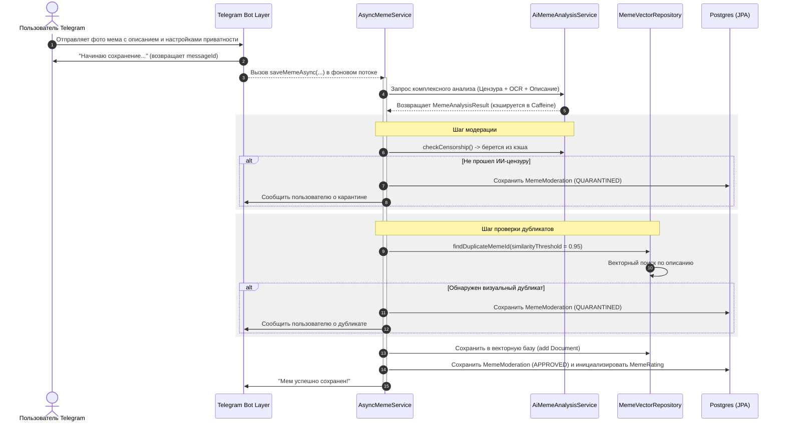

# Архитектурная карта проекта Baza (context.md)

Проект **Baza** — это интеллектуальный Telegram-бот для каталогизации, семантического поиска, автоматической ИИ-модерации и игрового сравнения мемов с ELO-рейтингом.

---

## 1. Структура директорий проекта

Ниже приведена схема структуры каталогов с описанием назначения каждого пакета и ключевых файлов.

```text
baza/
├── src/
│   ├── main/
│   │   ├── java/cringe/baza/
│   │   │   ├── BazaApplication.java        # Точка запуска Spring Boot приложения
│   │   │   ├── analysis/                   # Модуль ИИ-анализа и модерации мемов
│   │   │   │   ├── MemeCensorshipService   # Интерфейс проверки цензуры (NSFW, насилие и др.)
│   │   │   │   ├── MemeDescriptionService  # Интерфейс генерации описания мема
│   │   │   │   ├── MemeOcrService          # Интерфейс извлечения текста с картинки (OCR)
│   │   │   │   └── impl/
│   │   │   │       └── AiMemeAnalysisService # Реализация с кэшированием (Caffeine)
│   │   │   ├── battle/                     # Игровая механика сравнения мемов
│   │   │   │   ├── MemeBattleService       # Проведение авто-баттлов, ELO-расчеты
│   │   │   │   ├── MemeDuelService         # Сервис PvP дуэлей
│   │   │   │   ├── MemeDuelLifecycleService# Управление жизненным циклом дуэли (ставки, тайм-ауты)
│   │   │   │   └── MemeBattleScheduler     # Планировщик автоматических баттлов в чатах
│   │   │   ├── bot/                        # Слой Telegram-бота (Presentation Layer)
│   │   │   │   ├── command/                # Паттерн Command (Start, Save, Find, Swipe, Duel и др.)
│   │   │   │   ├── config/                 # Конфигурации (Telegram API, Async, Jackson)
│   │   │   │   ├── model/                  # Состояния пользователей и DTO (UserState, DuelActionResult)
│   │   │   │   └── service/                # Обработка обновлений, роутинг команд, Callback-запросы
│   │   │   ├── controller/                 # REST API контроллеры для админ-панели
│   │   │   │   ├── MemeController          # Поиск и отдача изображений мемов
│   │   │   │   └── AdminController         # CRUD-операции администрирования
│   │   │   ├── domain/                     # Сущности JPA (Схема реляционной БД PostgreSQL)
│   │   │   │   ├── TelegramUser            # Пользователи бота (рейтинг, баланс очков)
│   │   │   │   ├── MemeModeration          # Основная таблица мемов с метаданными и статусом модерации
│   │   │   │   ├── MemeRating              # ELO-рейтинг и статистика побед мемов
│   │   │   │   ├── MemeReport              # Жалобы пользователей на мемы
│   │   │   │   └── MemeSwipeVote           # Оценки лайков/дизлайков (BASE/CRINGE)
│   │   │   ├── exception/                  # Исключения бизнес-логики и ИИ-модулей
│   │   │   ├── meme/                       # Ядро бизнес-логики работы с мемами
│   │   │   │   ├── AsyncMemeService        # Асинхронный пайплайн сохранения и валидации мема
│   │   │   │   ├── MemeProcessor           # CRUD-операции над мемами (индекс + база)
│   │   │   │   ├── SwipeService            # Алгоритм подбора мемов для оценки пользователем
│   │   │   │   └── MemeDigestService       # Генерация еженедельных саркастичных ИИ-дайджестов
│   │   │   ├── model/                      # Модели данных (DTO-рекорды, енамы видимости и статусов)
│   │   │   │   ├── Meme                    # Рекорд мема (id, description, ocrText, fileId, ownerId)
│   │   │   │   └── IdRepository            # Базовый интерфейс хранилища
│   │   │   └── repository/                 # Репозитории доступа к данным
│   │   │   │   ├── MemeVectorRepository    # Обертка над VectorStore для семантического поиска
│   │   │   │   └── jpa/                    # Стандартные Spring Data JPA интерфейсы
│   │   │   └── user/                       # Управление сессиями и правами пользователей
│   │   └── resources/
│   │       ├── application.properties      # Конфигурационный файл приложения
│   │       └── static/index.html           # Фронтенд-интерфейс панели администратора
│   └── test/                               # Модульные, интеграционные и E2E тесты
├── build.gradle.kts                        # Конфигурация зависимостей и плагинов Gradle
├── docker-compose.yml                      # Контейнеризация PostgreSQL + pgvector
└── load-test.js                            # Скрипт k6 для нагрузочного тестирования поиска
```

---

## 2. Основные архитектурные сценарии

### Сценарий 1: Асинхронная загрузка и модерация мема


### Сценарий 2: Гибридный поиск мемов (RRF)
При запросе `/find <запрос>` репозиторий `MemeVectorRepository` объединяет результаты двух поисковых каналов с помощью алгоритма Reciprocal Rank Fusion:
1. **Семантический поиск:** `VectorStore` производит поиск по векторному индексу с использованием эмбеддингов Gemini (определяет смысл изображения и сюжета).
2. **Текстовый поиск:** Полнотекстовый поиск в PostgreSQL по полям `ocrText` (распознанный текст на картинке) и `description` (описание мема) с использованием нормализации букв «е» и «ё».
3. **Объединение (RRF):** Оценки позиций результатов в каждом списке суммируются по формуле:
   $$Score = \sum_{m \in M} \frac{1}{60 + rank_m}$$
4. **Фильтрация приватности:** Отфильтрованные по ELO или релевантности ID проходят проверку на уровень доступа пользователя:
   - `PUBLIC` — видны всем.
   - `PRIVATE` — видны только автору (`ownerId`).
   - `GROUP` — видны только участникам групп (`groupIds`), в которых состоит пользователь.

### Сценарий 3: Мем-Баттлы и Дуэли
- **Случайные баттлы:** Бот выбирает случайный мем из базы данных. Для создания конкурентного голосования второй мем подбирается через **векторную схожесть** (выбирается мем на схожую тему, например, кошки, IT-юмор и т.д.).
- **Дуэли пользователей (`/duel`):** Пользователи делают ставки очками. Каждый выбирает свой мем из своей приватной коллекции, после чего запускается интерактивное голосование в группе.
- **Расчет ELO:** По итогам голосования победивший мем увеличивает свой рейтинг, а проигравший — уменьшает по стандартной формуле ELO с K-фактором = 32. Статистика записывается в таблицу `meme_ratings`.

---

## 3. Настройки и конфигурация системы

Основные переменные настраиваются в `application.properties`:
- `spring.ai.google.genai.chat.options.model` — модель чата (`gemini-3.5-flash`).
- `spring.ai.google.genai.embedding.text.options.model` — модель эмбеддингов (`gemini-embedding-001`).
- `spring.ai.vectorstore.pgvector.distance-type` — метрика расстояния для векторов (`COSINE_DISTANCE`).
- `app.battle.duration-minutes` — время длительности баттлов и дуэлей.
- `app.bot.complaints-threshold` — количество жалоб от пользователей (таблица `meme_reports`), после достижения которого мем автоматически скрывается из индекса и отправляется в карантин.
